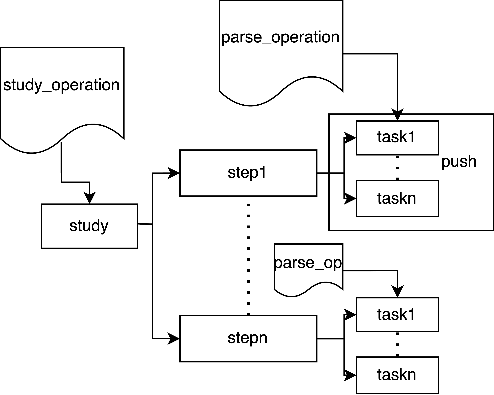

# dp2_user_guide

目录链接，流程图，示例链接。

[1.study_operation](study.md)

[2.parse_operation](parsefunction.md)

[3.Xpath_example](parsefunction.Xpath.md)

[4.jq_and_jmespath_example](data_out.jq_jmespath.md)

[5.parse_for_Special_table_example](parsefunction.parse_for_special_table.md)

dp2抽象流程图:

dp2实际操作流程图：

