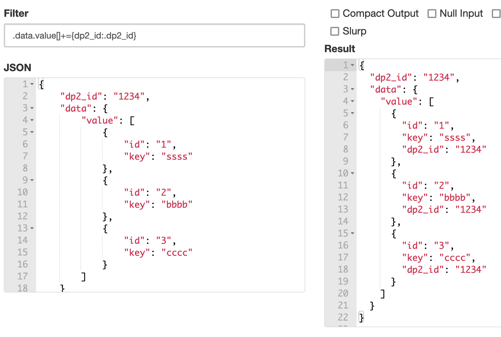
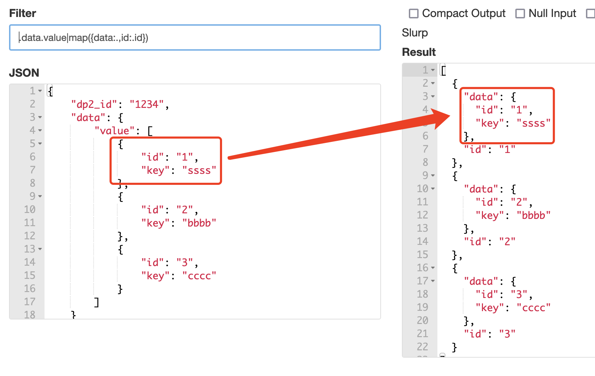
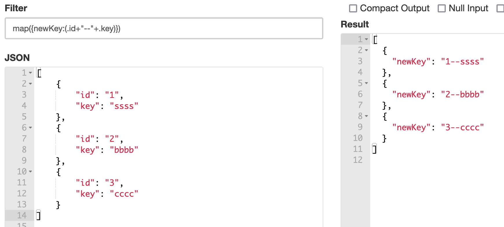
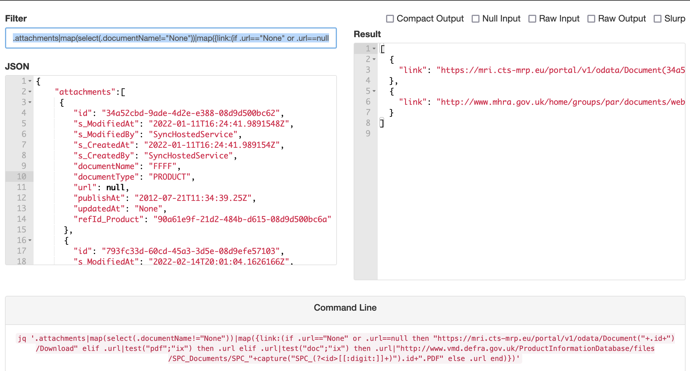

## jq && jmespath tips


#### 字符串拼接：join(',',['aa','bb'])

Parse Function中常用的JSON操作

（1）给子元素数字中每个element增加一个父元素中的值，比如给data.value中每个元素增加一个dp2_id的key：关键是+=

 


(2) 将数组中一个元素当做一个变量的值: 数组map以后，可以针对每个元素操作



(3) 将多个同级元素与字符串拼接后，形成一个新的值：用（）将多个值或字串链接的算式括起来



(4) 用select筛选数组中的元素，然后对元素中字段进行条件判断，然后拼接

```json
.attachments|map(select(.documentName!="None"))|map({link:(if .url=="None" or .url==null then "https://mri.cts-mrp.eu/portal/v1/odata/Document("+.id+")/Download" elif .url|test("pdf";"ix") then .url elif .url|test("doc";"ix") then .url|"http://www.vmd.defra.gov.uk/ProductInformationDatabase/files/SPC_Documents/SPC_"+capture("SPC_(?<id>[[:digit:]]+)").id+".PDF" else .url end)})
```



在线教程：https://stedolan.github.io/jq/tutorial/

#### parse json string

##### JQ parse json string

```json
"[{\"herb_cn_name\":\"\\u77ee\\u5730\\u8336\",\"herb_pinyin\":\"Aidicha\",\"herb_en_name\":\"Ardisiae Japonicae Herba\",\"child_cn_name\":\"\\u6b62\\u54b3\\u5e73\\u5598\\u836f\",\"child_en_name\":\"Antitussive Antiasthmetics\"}]"
```

Filter：`.|fromjson`

Result:

```json
[

 {

  "herb_cn_name": "矮地茶",

  "herb_pinyin": "Aidicha",

  "herb_en_name": "Ardisiae Japonicae Herba",

  "child_cn_name": "止咳平喘药",

  "child_en_name": "Antitussive Antiasthmetics"

 }

]
```

##### 从网页中提取JSON的parse function的不同写法：

第一种：

```json
{

 "elements": {

 "allData": {

   "col": "//script",

   "function": {

     "regexp": "data: (\\[\\{.+?\\}\\])",

     "callback": "json_decode"

   },

   "data_out": "[0]"

 }

  }

}
```

第二种

```json
{

 "elements": {

  "token": {

   "col": "//script",

   "function": {

"regexp": "&token=(.+?)'>",

"type": "string"

   }

  },

  "allData": {

   "col": "//script",

   "function": {

"regexp": "data: (\\[\\{.+?\\}\\])",

"type": "string"

   },

   "data_out": {

"jq": ".|fromjson"

   }

  }

 }

}
```

