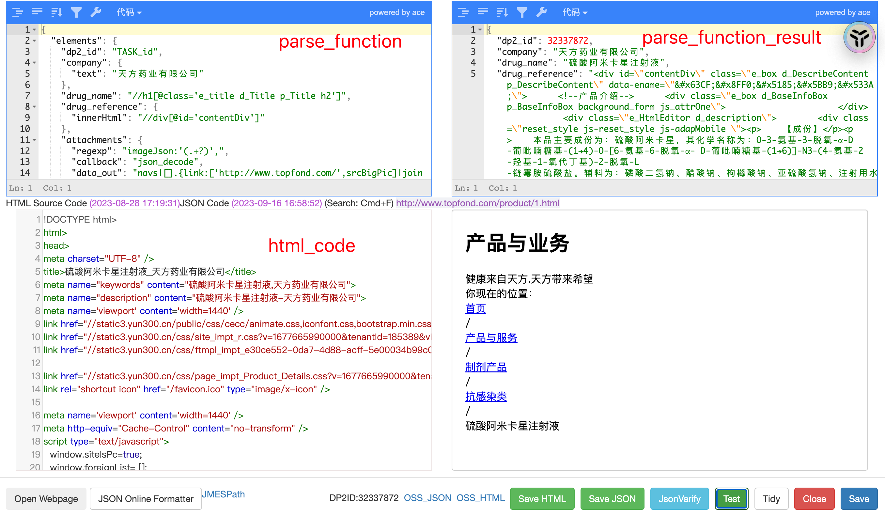

##### `elements:{}`提取字段列表

elements下面的字段可直接为xpath，或者 TASK_(.+) 这样的格式来返回task中的相应字段内容，支持对返回内容的进一步修饰，同xpath返回的内容一样

每个字段可直接为xpath路径，也可以为hash结构, 字段功能如下：

```
col: 直接提取此字段的xpath路径; 当col=~/^TASK_(.+)$/ 时，返回任务中对应key的值

text: 内容直接返回到结果中，作为标记字段

regexp: 按正则表达式提取内容

innerHtml: 按xpath提取html源代码

prefix: 在提取的内容上加前缀

postfix: 加后缀

callback: 以|分割的一个或多个字符串函数，比如 trim, parse_date, extract_date, extract_en_date, absolute_url,

function: regexp 与 return 构成的函数，更加灵活强大

must_match: 仅用在提取表格数据时，按正则丢弃某些不需要的行；非表格提取时不起作用
```

1. ###### col, regexp, innerHtml, text 为一级的内容提取函数: 

   - 优先级 `col > regexp > innerHtml > text`

   - 若存在高优先级的字段，则忽略低优先级的字段

   - col默认返回xpath对应的string，若设定`type:array`，则会返回不为空的list，这个在xpath路径下有多个元素的时候，可以直接将每个元素分开返回，比如有html:

     ```
     <div><span>张三</span><span>李四</span><span>王五</span><span>李二麻子</span></div>
     ```

     ```json
     “authors": {“col": “//div/span”, “type“: ”array“}
     ```

     上面的路径中，若不指定array，返回的是所有author连在一起的字串，指定type为array后，返回

     ```
     “authors”:[“张三”, “李四”, “王五”, “李二麻子"]
     ```

   - regexp相当于function的简化版，若不设定return, 则默认返回每个匹配的第一个，即 return = [0]

   - innerHtml 返回xpath对应节点的html源码拼接后的字串

2. ###### callback, function, default, data_out为提取后的数据进一步修饰的函数：

   - 优先级 `callback > function > default > data_out`

   - 修饰函数会按先callback 后 function的次序执行

   - | callback函数 | 说明                                                         |
     | ------------ | ------------------------------------------------------------ |
     | trim         | 删除半角空格                                                 |
     | trim2        | 删除全角和半角空格                                           |
     | parse_date   | 将不同格式的日期，格式化为：YYYY-MM-DD2017年1月1日==>2017-01-012017-1-1==>2017-01-012017.1.1==>2017-01-012017/1/1==>2017-01-01 |
     | extract_date | 从字串中提取第一个匹配的日期，然后格式化为：YYYY-MM-DD       |
     | extract_text | 清除html中标签，仅获得文字内容                               |
     | dp2_filter   | 过滤不符合正则表达式的txt                                    |
     | json_extract | 提取json中的某个元素                                         |
     | absolute_url | 将相对地址转化为绝对地址                                     |

   - ```json
     "function":{"regexp":"(\d+)(FEG)","return":["TAG",0,"HEL",1],"type":"array"}
     ```

     - function有三个参数：regexp, return, type
     - regexp为正则表达式，可以通过()对部分匹配的内容分组，然后在return中按序号（从0开始）自由组合
     - return中除支持()匹配的序号外，还可以为其他字符串，返回的结果是按数组指定的次序拼接的结果
     - type默认为array, 返回list；若为’string’或其他则返回list直接拼接以后的字串

   - default设定alternative节点的路径，当col节点返回的txt为空时触发。

   - data_out最后应用[JMESPath](https://jmespath.org/)或[jq](https://jqplay.org/)对结果进一步修饰

3. ###### prefix, postfix 前面的内容提取到后，最后把前后缀加上返回

   - 若需要解析多行的表格数据，在elements同级增加total_rows节点

   - - total_rows节点为所有行的数组xpath路径
     - 若elements中字段的相对应的rows与total_rows指定的路径不同时，可以在col同级增加row节点

   - elements通常为hash数组{}，这样返回的所有字段都必须有名字，若希望返回没有名字的数组，可以在elements后面放一个由xpath字串构成的数组

   - total_rows 中的xpath路径必须为针对整个页面的路径，不能是相对于某个节点的路径

##### 界面内容



##### 示例

1. 单独提取文字

```html
$html=‘<html><body><span id=“key”>hello</span></body></html>';

```

提取html中hello的parse_function如下：

```json
{“elements”:{"content":"//span[@id=‘key’]/text()"}}
```

2. 提取日期

   ```html
   <html><body><span id="date"> 2017年7月19日 </span></body></html>
   ```

   提取日期并加上前后缀

   ```json
   {
     "elements":{
       "date":{
         "prefix":"---",
         "col":"//span[@id=\"date\"]/text()",
         "callback":"trim|parse_date",
         "postfix":"---"
       }
     }
   }
   ```

   result

   ```json
   {
     "date": "---2017-07-19---"
   }
   ```

   

3. 嵌套循环+Elements 为数组

```html
<div class="record-item">
    <div class="left-record">
        <div class="record-title">
            <span class="index">8.</span>
            <a class="fulltext" href="http://f.wanfangdata.com.cn/download/Periodical_swhx200812012.aspx" target="_blank">全文</a>
            <a class="title" href="http://d.old.wanfangdata.com.cn/Periodical/swhx200812012" target="_blank">P-糖蛋白在多药耐药的K562细胞转运苯妥英纳与<em>卡马西平</em>中的作用</a>
            <span class="cited">(<t>被引用</t>&nbsp;8&nbsp;<t>次</t>)</span>
            
        </div>
        <div class="record-subtitle">
            [期刊论文]&nbsp;
        <a href="http://c.old.wanfangdata.com.cn/Periodical-swhx.aspx">《生物化学与生物物理进展》</a>
            <span class="core">
                <span title="被中信所《中国科技期刊引证报告》收录">ISTIC</span>
                
                <span title="被SCI收录">SCI</span>
                <span title="被北京大学《中文核心期刊要目总览》收录">PKU</span>
                
            </span>-<a href="http://c.old.wanfangdata.com.cn/periodical/swhx/2008-12.aspx">2008年12期</a>
            <a class="creator" target="_blank" href="http://social.old.wanfangdata.com.cn/Locate.ashx?ArticleId=swhx200812012&;Name=%e9%99%88%e8%8b%b1%e8%be%89">陈英辉</a><a class="creator" target="_blank" href="http://social.old.wanfangdata.com.cn/Locate.ashx?ArticleId=swhx200812012&;Name=%e8%b5%b5%e6%b0%b8%e6%b3%a2">赵永波</a>
        </div>
        <div class="record-desc">
            研究证实,多药转运体与难治性癫痫耐药机制密切相关,P-糖蛋白在其中起重要作用.主要研究P-糖蛋白拮抗剂维拉帕米对P-糖蛋白过表达的K562细胞耐药性及细胞内苯妥英纳与<em>卡马西平</em>浓度的影响.首先建立了P-糖蛋白高表达的K56...<br>
        </div>
        <div class="record-keyword">
            <span>难治性癫痫</span><span>P-糖蛋白</span><span>维拉帕米</span><span>多药耐药</span>
        </div>
    </div>
    <div class="record-action-link">
        
        <a class="download" href="http://f.wanfangdata.com.cn/download/Periodical_swhx200812012.aspx" target="_blank">
            <i class="icon iconfont icon-download"></i>
            <span class="text">下载全文</span>
        </a>
        <a class="view" href="http://f.wanfangdata.com.cn/view/P-糖蛋白在多药耐药的K562细胞转运苯妥英纳与卡马西平中的作用.aspx?ID=Periodical_swhx200812012" target="_blank">
            <i class="icon iconfont icon-view"></i>
            <span class="text">查看全文</span>
        </a>
        
        <a class="export exportLink" data-resourceid="Periodical_swhx200812012">
            <i class="icon iconfont icon-export"></i>
            <span class="text">导出</span>
        </a>
    </div>
</div>


<div class="record-item">
    <div class="left-record">
        <div class="record-title">
            <span class="index">9.</span>
            <a class="fulltext" href="http://f.wanfangdata.com.cn/download/Periodical_zglcylxzz201412017.aspx" target="_blank">全文</a>
            <a class="title" href="http://d.old.wanfangdata.com.cn/Periodical/zglcylxzz201412017" target="_blank">奥卡西平和<em>卡马西平</em>治疗原发性三叉神经痛的系统评价和荟萃分析</a>
            <span class="cited">(<t>被引用</t>&nbsp;13&nbsp;<t>次</t>)</span>
            
        </div>
        <div class="record-subtitle">
            [期刊论文]&nbsp;
        <a href="http://c.old.wanfangdata.com.cn/Periodical-zglcylxzz.aspx">《中国临床药理学杂志》</a>
            <span class="core">
                <span title="被中信所《中国科技期刊引证报告》收录">ISTIC</span>
                
                
                <span title="被北京大学《中文核心期刊要目总览》收录">PKU</span>
                
            </span>-<a href="http://c.old.wanfangdata.com.cn/periodical/zglcylxzz/2014-12.aspx">2014年12期</a>
            <a class="creator" target="_blank" href="http://social.old.wanfangdata.com.cn/Locate.ashx?ArticleId=zglcylxzz201412017&;Name=%e7%bd%97%e7%a5%8e%e6%98%8e">罗祎明</a><a class="creator" target="_blank" href="http://social.old.wanfangdata.com.cn/Locate.ashx?ArticleId=zglcylxzz201412017&;Name=%e5%be%90%e6%8d%b7%e6%85%a7">徐捷慧</a><a class="creator" target="_blank" href="http://social.old.wanfangdata.com.cn/Locate.ashx?ArticleId=zglcylxzz201412017&;Name=%e6%98%93%e6%b9%9b%e8%8b%97">易湛苗</a><a class="creator" target="_blank" href="http://social.old.wanfangdata.com.cn/Locate.ashx?ArticleId=zglcylxzz201412017&;Name=%e7%bf%9f%e6%89%80%e8%bf%aa">翟所迪</a>
        </div>
        <div class="record-desc">
            目的：评价奥卡西平和<em>卡马西平</em>治疗原发性三叉神经痛的疗效和安全性。方法计算机检索Cochrane library、PubMed、Medline、中国生物医学文献数据库、中国知网和万方等数据库，结合手工检索，收集比较奥卡西平与<em>卡马西平</em>治疗原发...<br>
        </div>
        <div class="record-keyword">
            <span>奥卡西平</span><span>卡马西平</span><span>三叉神经痛</span><span>荟萃分析</span><span>oxcarbazepine</span><span>carbamazepine</span><span>primary trigeminal neuralgia</span><span>Meta-analysis</span>
        </div>
    </div>
    <div class="record-action-link">
        
        <a class="download" href="http://f.wanfangdata.com.cn/download/Periodical_zglcylxzz201412017.aspx" target="_blank">
            <i class="icon iconfont icon-download"></i>
            <span class="text">下载全文</span>
        </a>
        <a class="view" href="http://f.wanfangdata.com.cn/view/奥卡西平和卡马西平治疗原发性三叉神经痛的系统评价和荟萃分析.aspx?ID=Periodical_zglcylxzz201412017" target="_blank">
            <i class="icon iconfont icon-view"></i>
            <span class="text">查看全文</span>
        </a>
        
        <a class="export exportLink" data-resourceid="Periodical_zglcylxzz201412017">
            <i class="icon iconfont icon-export"></i>
            <span class="text">导出</span>
        </a>
    </div>
</div>


<div class="record-item">
    <div class="left-record">
        <div class="record-title">
            <span class="index">10.</span>
            
            <a class="title" href="http://d.old.wanfangdata.com.cn/Periodical/hzlgdxxb201312024" target="_blank">紫外激活过硫酸盐降解水中<em>卡马西平</em>研究</a>
            <span class="cited">(<t>被引用</t>&nbsp;15&nbsp;<t>次</t>)</span>
            
        </div>
        <div class="record-subtitle">
            [期刊论文]&nbsp;
        <a href="http://c.old.wanfangdata.com.cn/Periodical-hzlgdxxb.aspx">《华中科技大学学报（自然科学版）》</a>
            <span class="core">
                <span title="被中信所《中国科技期刊引证报告》收录">ISTIC</span>
                <span title="被EI收录">EI</span>
                
                <span title="被北京大学《中文核心期刊要目总览》收录">PKU</span>
                
            </span>-<a href="http://c.old.wanfangdata.com.cn/periodical/hzlgdxxb/2013-12.aspx">2013年12期</a>
            <a class="creator" target="_blank" href="http://social.old.wanfangdata.com.cn/Locate.ashx?ArticleId=hzlgdxxb201312024&;Name=%e9%ab%98%e4%b9%83%e4%ba%91">高乃云</a><a class="creator" target="_blank" href="http://social.old.wanfangdata.com.cn/Locate.ashx?ArticleId=hzlgdxxb201312024&;Name=%e8%83%a1%e6%a0%a9%e8%b1%aa">胡栩豪</a><a class="creator" target="_blank" href="http://social.old.wanfangdata.com.cn/Locate.ashx?ArticleId=hzlgdxxb201312024&;Name=%e9%82%93%e9%9d%96">邓靖</a><a class="creator" target="_blank" href="http://social.old.wanfangdata.com.cn/Locate.ashx?ArticleId=hzlgdxxb201312024&;Name=%e9%99%88%e4%b9%89%e6%98%a5">陈义春</a>
        </div>
        <div class="record-desc">
            针对传统工艺难以有效去除水中抗生素的问题,采用一种高级氧化技术去除水中典型药物-<em>卡马西平</em>(CBZ).考察了过硫酸盐浓度、<em>卡马西平</em>初始浓度、pH值、碳酸根离子和氯离子对<em>卡马西平</em>降解效果的影响.结果表明:紫外光(UV)会催化...<br>
        </div>
        <div class="record-keyword">
            <span>卡马西平</span><span>紫外光</span><span>过硫酸盐</span><span>硫酸自由基</span><span>动力学</span><span>carbamazepine</span><span>UV</span><span>persulfate</span><span>sulfate radicals</span><span>kinetics</span>
        </div>
    </div>
    <div class="record-action-link">
        
        <a class="export exportLink" data-resourceid="Periodical_hzlgdxxb201312024">
            <i class="icon iconfont icon-export"></i>
            <span class="text">导出</span>
        </a>
    </div>
</div>


```

Parse function:

```json
{
  "total_rows": "//div[@class='left-record']",
  "elements": {
    "creator": {
      "elements": [
        "./text()"
      ],
      "total_rows": "//div[@class='record-subtitle']/a[@class='creator']"
    },
    "keyword": {
      "elements": [
        "."
      ],
      "total_rows": "//div[@class='record-keyword' ]/span"
    }
  }
}
```

Result:

```json
[
  {
    "creator": [
      "陈英辉",
      "赵永波",
      "罗祎明",
      "徐捷慧",
      "易湛苗",
      "翟所迪",
      "高乃云",
      "胡栩豪",
      "邓靖",
      "陈义春"
    ],
    "keyword": [
      "难治性癫痫",
      "P-糖蛋白",
      "维拉帕米",
      "多药耐药",
      "奥卡西平",
      "卡马西平",
      "三叉神经痛",
      "荟萃分析",
      "oxcarbazepine",
      "carbamazepine",
      "primary trigeminal neuralgia",
      "Meta-analysis",
      "卡马西平",
      "紫外光",
      "过硫酸盐",
      "硫酸自由基",
      "动力学",
      "carbamazepine",
      "UV",
      "persulfate",
      "sulfate radicals",
      "kinetics"
    ]
  },
  {
    "creator": [
      "陈英辉",
      "赵永波",
      "罗祎明",
      "徐捷慧",
      "易湛苗",
      "翟所迪",
      "高乃云",
      "胡栩豪",
      "邓靖",
      "陈义春"
    ],
    "keyword": [
      "难治性癫痫",
      "P-糖蛋白",
      "维拉帕米",
      "多药耐药",
      "奥卡西平",
      "卡马西平",
      "三叉神经痛",
      "荟萃分析",
      "oxcarbazepine",
      "carbamazepine",
      "primary trigeminal neuralgia",
      "Meta-analysis",
      "卡马西平",
      "紫外光",
      "过硫酸盐",
      "硫酸自由基",
      "动力学",
      "carbamazepine",
      "UV",
      "persulfate",
      "sulfate radicals",
      "kinetics"
    ]
  },
  {
    "creator": [
      "陈英辉",
      "赵永波",
      "罗祎明",
      "徐捷慧",
      "易湛苗",
      "翟所迪",
      "高乃云",
      "胡栩豪",
      "邓靖",
      "陈义春"
    ],
    "keyword": [
      "难治性癫痫",
      "P-糖蛋白",
      "维拉帕米",
      "多药耐药",
      "奥卡西平",
      "卡马西平",
      "三叉神经痛",
      "荟萃分析",
      "oxcarbazepine",
      "carbamazepine",
      "primary trigeminal neuralgia",
      "Meta-analysis",
      "卡马西平",
      "紫外光",
      "过硫酸盐",
      "硫酸自由基",
      "动力学",
      "carbamazepine",
      "UV",
      "persulfate",
      "sulfate radicals",
      "kinetics"
    ]
  }
]
```

[Special_for_table](parsefunction.parse_for_special_table.md)
