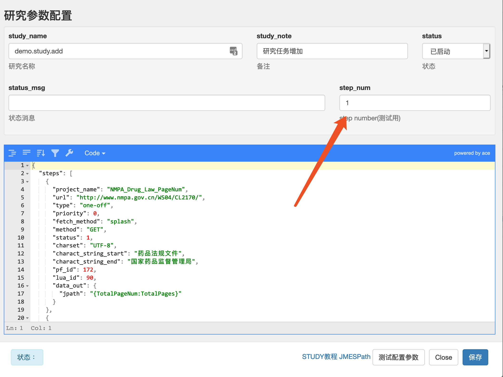
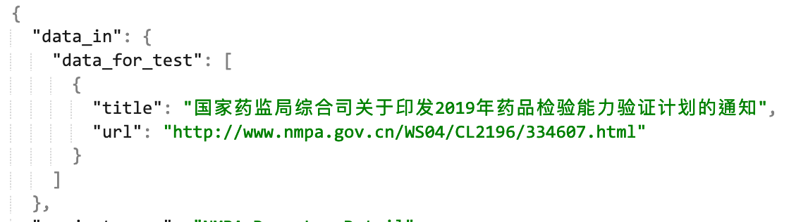
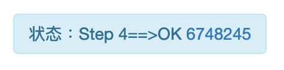

 

##### 界面状态说明：



step_num输入要测试的step序号（从1开始），然后点击”测试配置参数“，在左下角状态里面会看到错误信息，或生成的日期的ID，点击ID跳转到添加的任务界面


除第一步外，其他step测试需要在data_in中增加data_for_test参数，用于模拟上一步传来的数据。数据结构可从上一步添加的任务的JSON结果中查看。若为list时，只要用一条数据测试即可，比如：



点击”测试配置参数“后，只有状态处显示OK，并且有任务ID出现时，才能证明当前任务配置无误。



这一步只是测试了增加任务，并没有测试data_out中的参数，需点击状态中的任务ID，等其下载完成且转移后，study_msg显示ok，才说明任务的data_out参数没问题。

data_for_test 可以保存在steps中，实际运行时，不会其作用，只有在测试时被调用。

------

##### study的基本结构：

```json
{
  "steps": 
[
  {},
  {}
]
}
```

全局变量放在steps同级，只能为简单的 key==>value形式（value为字符串）

steps为一个List结构，每个step按次序放在{}中

##### 下面是一个典型的step的结构：

```json
{

 "project_name": "NMPA_Drug_Law_PageNum",

 "url": "http://www.nmpa.gov.cn/WS04/CL2170/",

 "type": "one-off",

 "priority": 0,

 "fetch_method": "splash",

 "method": "GET",

 "status": 1,

 "charset": "UTF-8",

 "charact_string_start": "药品法规文件",

 "charact_string_end": "国家药品监督管理局",

 "pf_id": 172,

 "lua_id": 90,

 "data_out": {

  "jpath": "{TotalPageNum:TotalPages}"

 }

}
```

###### step结构中支持所有的dp2 task的配置参数，默认的参数如下：

```json
{
    "study_id": None,
    "study_name": None,
    "project_name": None,
    "extra_data": None,
    "url": None,
    "type": "one-off",
    "priority": 0,
    "fetch_method": "direct",
    "method": "GET",
    "data": None,
    "cookies": None,
    "through_proxy": 0,
    "status": 0,
    "charset": "UTF-8",
    "charact_string_start": None,
    "charact_string_end": None,
    "charact_string_notry": None,
    "pf_id": None,
    "ck_id": None,
    "lua_id": None,
}
```

###### date_out 和 date_in

除dp2 task的参数外，step中还含有data_in, data_out两个可选参数，默认是将每个step获得的数据直接传到下一步，若要对传到下一步的数据进行修改，可用data_out来配置。

```json
data_out的结构如下：

 "data_out": {
        "jpath": "",
        "api": {
          "url": "http://api2.drugsea.cn/dp2/mongo/save",
          "table": "china_manufacture_products",
          "where": {
            "uniqueId": "{dp2_id}"
          },
          "data": {
            "dp2_id": "{dp2_id}",
            "drug_name": "{drug_name}",
            "company": "{company}",
            "attachments": "{attachments}",
            "drug_reference": "{drug_reference}"
          }
        }
      },
```

data_in负责对传到这一步的数据进行修饰，然后再转给任务管理程序。

```json
data_in的结构如下：
{
      "data_in": {
        "data_for_test": [
          {
            "link": "http://www.topfond.com/product/1.html",
            "drug_name": "硫酸阿米卡星注射液"
          }
        ]
      },
```

[DP2_study实例](http://dp2.labqr.com/e/dp2/study?offset=0&order_by=&direction=&tnum=&id=&study_name=company.tfyy.drugs&status=&status_msg=&study_note=&study_content=)

|       |      |                                                              |
| ----- | ---- | ------------------------------------------------------------ |
| jpath | 可选 | JMESPath查询参数，当值为空时，代表对输入数据不处理           |
| api   | 可选 | 配置数据post到的api地址，包含以下三个参数：url: 必须, table: 可选，设定数据要保存到的表的名称，若API不需要，可以不设定；where: 可选，用来判断数据唯一性的条件，可为一个或多个条件，只能精确匹配；默认为{“id”:”{id}”}, 即用post数据中的id作为唯一性判断的标准。 若用默认的where时，要确保在post data中已经含有id字段 |

当data_out仅含有jpath参数时，可写成：”data_out”:”JMESPath"

data_in与data_out相同，只是没有api参数

变量替换规则：

- step中任何地方可以用{variable_name}的形式代表运行中可替换的变量
- 变量优先从局部数据（比如上一个step中的data_out中数据）中查找，若没有就在全局变量中查找；若都没有，则变量不做替换

step的任务管理程序只能处理 dict和list两种情况的数据，需用data_in和data_out将下载的数据转化成所需要的格式

- 若一个页面的数据会生成多个子任务时，传递的为list，list中每个元素分别用来配置要下载的子任务（这时url为字符串）
- 第二种生成多个子任务的情况是，传递的为dict，同时url为dict结构，这时会根据url中pattern和iteration两个参数，生成批量的子任务
- data_out的数据为dict，且url为string时，生成单一的任务

###### url为dict时循环遍历操作：

```json

{
  "pattern": "http://www.nmpa.gov.cn/WS04/CL2170/index(*).html",
  "iteration": {
    "first": "",
    "start": 1,
    "stop": "{TotalPageNum}-1",
    "format": "_{}"
  }
}
```

- pattern中必须含有(*)，这里为系列地址中要改变的部分；暂不支持同时改变多个变量的情况，但pattern中支持局部或全局变量

- iteration的参数：

- - first 可选，用来设定第一页与其他页面生成规律不同的情况；

  - start 可选，默认从1开始；

  - stop 可选，默认为”{TotalPageNum}”，即上一个step传来的数据中需包含TotalPageNum参数

  - format 可选，默认为”{}”，也就是对数字不做改变，此处为python中的format格式：

  - - 比如地址为：0001，0002，0003 时，format=“{:04d}"
    - {}前后增加的字符串会直接加到url地址中

```json
"url": {
        "pattern": "http://www.nmpa.gov.cn/WS04/CL2170/index(*).html?offset={offset}",
        "iteration": {
          "first": "",
          "start": 1,
          "stop": "{TotalPageNum}-1",
          "format": "_{}”,
          “offset”:”(i-1)*10"
        }
}
```

- 含有iteration的url，如果需要多个与页码相关的参数，可在iteration中增加相关变量，然后在pattern中直接引用。比如要增加offset，offset=(i-1)*10，i为当前页码

- offset后面为关于页码i的有效表达式

###### extra_data 可以用来保存多step时需要的变量

[Study.data_out中支持的关键字](study.data_out)
